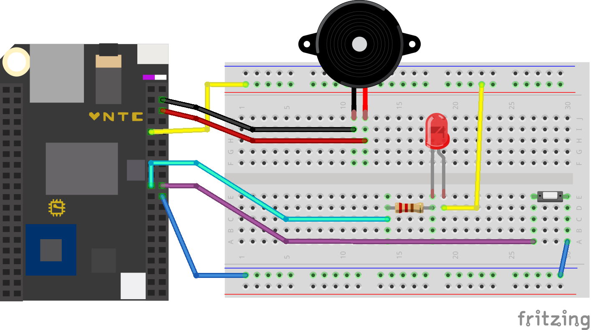

# Wetterbot

The wetterbot is a friendly robot that tells us the weather. The name is Pam. Weather Pam.

It repeatedly fetches the current weather from the [Dark Sky API](https://darksky.net/dev/). When the button on the top is pressed, it reads the current weather and the forecast for the next day while blinking with it’s eyes.

https://robert.katzki.de/projects/wetterbot

## Setup

The wetterbot contains a *[C.H.I.P.](https://getchip.com/pages/chip)* inside. Connect the button, the LED(s) and the speaker as shown here:

Get and install [CHIP_IO
](https://github.com/xtacocorex/CHIP_IO) on the *C.H.I.P.* Install [forecastiopy](https://github.com/dvdme/forecastiopy) which is an API wrapper for the Dark Sky API. Copy the python files over to the *C.H.I.P.* and execute `sudo python main.py`. The bot will tell the weather once it started and then every time the button is pressed.